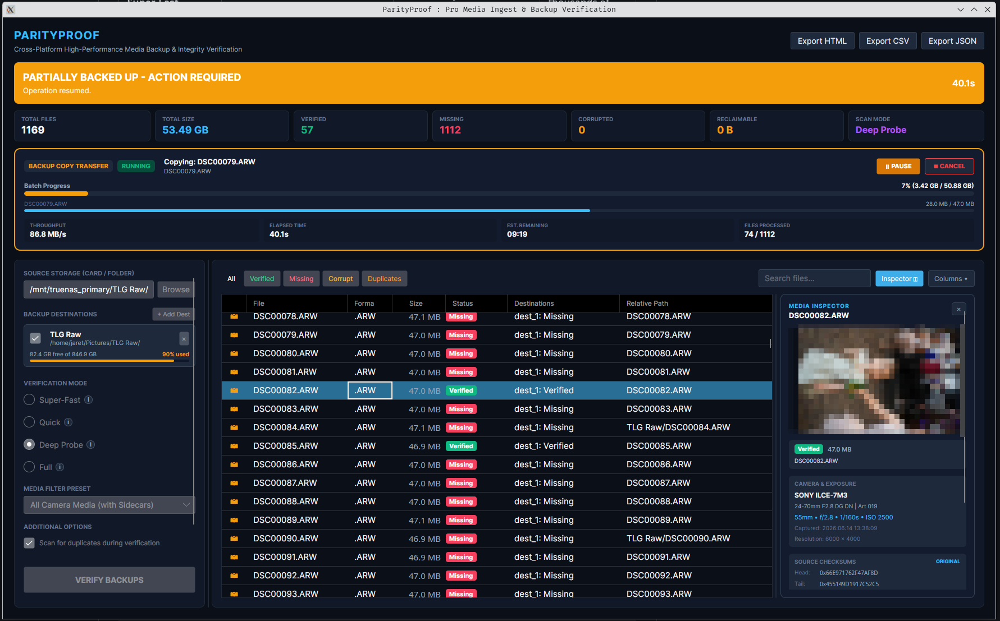

# ParityProof

> **Peace of mind before you format.** Instant, reliable backup verification for photographers, videographers, and creators.

---

## Why ParityProof?

Every photographer knows the anxiety of formatting a memory card after a shoot.

- Did every photo from that 3,000-shot wedding actually transfer?
- Did your operating system silently skip a corrupt video clip during drag-and-drop?
- Did your assistant copy the card to the primary SSD, but forget the secondary backup drive?
- Did you rename files during import (for example, `2026_Smith_Wedding_001.CR3`) or organize them into date folders, making normal folder comparison impossible?

**ParityProof eliminates the guesswork.** It inspects the actual image and video data on your memory card and confirms whether every file safely exists across one or more backup destinations.

---

## The "Safe to Format" Verdict

When you run a scan, ParityProof gives you a prominent, color-coded status banner right at the top of the screen:

- 🟢 **Safe to Format**: Every file on the card is verified and safely backed up across all your selected backup drives. You can format with complete confidence.
- 🟡 **Partially Backed Up**: Media exists on some drives (e.g., your laptop SSD), but is missing from other backup targets (e.g., your external backup drive).
- 🔴 **Unsafe to Format**: One or more files on the card are completely missing from your backups or are corrupt. Do not format your card!

---

## Features Designed for Photographers

### 1. Smart Matching (Renamed & Reorganized Files)
Many photographers rename files during import or use Lightroom / Capture One to sort photos into `YYYY/MM/DD` folder structures. ParityProof uses content-based signatures rather than rigid folder paths. Even if your photos were renamed or moved into nested subfolders on your backup drives, ParityProof locates and verifies them automatically.

### 2. Multi-Destination Backup Verification
Professional workflows follow the 3-2-1 backup rule. ParityProof allows you to check your memory card against multiple destinations simultaneously (e.g., your internal editing drive, a portable field SSD, and a studio NAS).

### 3. One-Click Missing File Transfer
If a scan reveals that a handful of files were missed during ingest, you do not need to manually find them or re-copy the entire card. Click **"Copy Missing to Backup"** to transfer only the missing files directly to your destination drives with built-in disk space validation.

### 4. Automatic Card Detection
Plug in your SD, CFexpress, CFast, or microSD card. ParityProof automatically detects the newly inserted card and prompts you to verify it immediately.

### 5. Media & EXIF Inspector
Select any photo or video in the list to view its details directly inside ParityProof:
- Embedded camera metadata: Camera make and model, lens, focal length, aperture, shutter speed, and ISO.
- File dimensions, size, and category.
- Side-by-side hash comparison for instant verification diagnostics.

### 6. Duplicate Detection
Find duplicate photos and videos across your card or backup storage. Reclaim disk space and clean up accidental double-imports before archiving.

### 7. Filter Presets for Camera Workflows
Focus on what matters without clutter from system files:
- **Photos Only**: RAW formats and standard images.
- **Photos and Videos**: Includes high-bitrate video clips and RAW video.
- **All Camera Media (with Sidecars)**: Includes `.xmp` develop sidecars, `.thm` thumbnails, and `.lrv` low-resolution proxy files.

### 8. Shareable Verification Reports
Generate professional, timestamped audit reports in **HTML**, **CSV**, or **JSON**. Perfect for Digital Imaging Technicians (DITs), studio archives, or delivering proof of backup to production clients.

---

## Verification Modes: Speed vs. Thoroughness

Choose the right balance of speed and depth for your shoot:

| Mode | How It Works | Best For | Typical Speed |
| :--- | :--- | :--- | :--- |
| **Super-Fast** | Checks file existence and exact byte count. | Quick sanity checks when you are in a rush. | Sub-second for thousands of files |
| **Quick (Recommended)** | Checks file size plus 64 KB header and trailer signatures. Detects incomplete file copies or truncated files. | Everyday post-shoot checks for cards and drives. | ~3 seconds for a 128 GB card |
| **Deep Probe** | Samples multiple slices across the file (header, interior sections, and trailer). | High-resolution RAW bursts and large video files where interior integrity matters. | Seconds to tens of seconds |
| **Full** | Reads every single byte sequentially to guarantee bit-for-bit parity. | Archival workflows, mission-critical commercial projects, or suspect memory cards. | Limited only by card reader read speed |

---

## Quick Start: 3 Simple Steps

1. **Select Source**: Choose your camera card or card reader drive. (ParityProof auto-detects newly inserted cards).
2. **Add Backup Destination(s)**: Select the folder(s) or external drive(s) where you transferred your photos.
3. **Run Verification**: Click **Run Verification** and check your status banner. If green, you are safe to format!

---

## Supported Camera & Media Formats

ParityProof recognizes virtually all modern camera and video formats out of the box:

- **RAW Photos**: Canon (`.cr2`, `.cr3`), Sony (`.arw`), Nikon (`.nef`), Fujifilm (`.raf`), Adobe DNG (`.dng`), Panasonic Lumix (`.rw2`), Olympus/OM System (`.orf`).
- **Standard Images**: JPEG (`.jpg`, `.jpeg`), HEIC/HEIF (`.heic`, `.heif`), TIFF (`.tif`, `.tiff`), PNG (`.png`), WebP (`.webp`).
- **Video Media**: MP4 (`.mp4`), QuickTime (`.mov`), MXF (`.mxf`), Blackmagic RAW (`.braw`), RED RAW (`.r3d`), MTS (`.mts`), AVI (`.avi`).
- **Workflow Sidecars**: Lightroom/Capture One metadata sidecars (`.xmp`), camera thumbnails (`.thm`), and camera proxies (`.lrv`).

---

## Screenshots

## Technical Highlights (Under the Hood)

For DITs, systems engineers, and technical creators who want to know how ParityProof delivers its speed:

- **NativeAOT Compiled**: Built with C# (.NET 10) and compiled ahead-of-time into a standalone native binary. Starts up in under 50 ms with a memory footprint under 50 MB.
- **Hardware-Accelerated Hashing**: Uses SIMD-accelerated `XxHash3` (AVX2, AVX-512, and ARM Neon), hashing data at speeds between 15 GB/s and 30 GB/s per core.
- **Direct I/O Engine**: Bypasses operating system file caching using unbuffered direct I/O (`FILE_FLAG_NO_BUFFERING` on Windows, `fcntl F_NOCACHE` on macOS/Linux) to test true physical media integrity without false cache hits.
- **Persistent SQLite Index**: Caches backup directory file signatures so repeat scans against multi-terabyte drives execute almost instantly.
- **Cross-Platform Dark UI**: Modern dark theme built with Avalonia UI, designed to match professional creative suites like DaVinci Resolve and Lightroom.

---

## Downloads & Platforms

ParityProof is available as a standalone desktop application for **macOS**, **Windows**, and **Linux**:

- **macOS**: Apple Silicon (`osx-arm64`) and Intel (`osx-x64`) DMG packages.
- **Windows**: Windows 64-bit (`win-x64`), ARM64 (`win-arm64`), and 32-bit (`win-x86`) installers and portable archives.
- **Linux**: Ubuntu/Debian `.deb` packages and portable `.tar.gz` archives for x64 and ARM64.

Check the [Releases](https://github.com/jav76/ParityProof/releases) page to download the latest build.

For build automation and versioning details, refer to [docs/VERSIONING_AND_RELEASES.md](docs/VERSIONING_AND_RELEASES.md).

---

## License

ParityProof is open source under the [MIT License](LICENSE).
